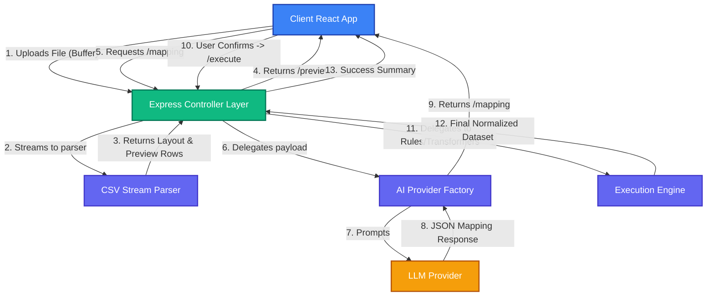

<div align="center">
  <h1>🚀 GrowEasy AI-Powered CSV Importer</h1>
  <p><strong>A production-ready, highly scalable, and intelligent data migration pipeline.</strong></p>
  <p>Seamlessly map, validate, and import messy CSV datasets into standard CRM formats using Large Language Models (LLMs).</p>
</div>

<br />

## 🌟 Overview

The GrowEasy CSV Importer solves one of the most frustrating aspects of B2B SaaS onboarding: messy data imports. Instead of forcing users to manually map dozens of columns, this engine leverages LLMs (Anthropic Claude, Google Gemini, or OpenAI) to heuristically analyze CSV structures, sample rows, and contextually map them to a strict CRM target schema.

Built with a clean Node.js/Express backend and a highly responsive React/Vite frontend wizard.

---

## ✨ Features

- **Multi-Step Wizard UX**: A polished, step-by-step React interface with accessibility (`aria` standards) and keyboard navigation.
- **Smart AI Header Mapping**: Uses LLM JSON-mode parsing to match arbitrary headers (e.g., `Client First Name`) to strictly typed CRM schemas (e.g., `first_name`) along with confidence scoring.
- **Robust Pipeline Architecture**: Streams large files to disk via Multer, validates structure dynamically, and runs strict normalization checks (Phone/Email sanitization, Rule 7 validations).
- **Graceful Error Handling**: Fallbacks to heuristic text-matching if the AI provider times out or hits rate limits.
- **Performance First**: Implements `React.lazy` component chunking, `useMemo` optimizations, and sticky headers for visualizing large datasets.

---

## 🏗️ Architecture

The system decouples data ingestion, mapping intelligence, and execution into an orchestrated pipeline. 



---

## 📂 Folder Structure

```text
GrowEasy/
├── client/                 # React + Vite Frontend
│   ├── src/
│   │   ├── components/     # Wizard steps, Toasts, ErrorBoundary
│   │   ├── hooks/          # Custom hooks (e.g. useApiRequest)
│   │   ├── store/          # Zustand global state
│   │   ├── services/       # API wrappers
│   │   └── constants/      # Shared configs
├── src/                    # Node.js + Express Backend
│   ├── config/             # Env vars, constraints, limits
│   ├── constants/          # CRM schemas, error codes
│   ├── controllers/        # Express route handlers
│   ├── middlewares/        # Error catching, Multer config
│   ├── services/           # Business logic (CSV, AI, Import)
│   └── utils/              # Winston logger, Custom error classes
└── examples/               # Example datasets (Optional)
```

---

## 🔌 API Overview

The backend exposes three core endpoints to manage the data pipeline:

| Endpoint | Method | Purpose |
|----------|--------|---------|
| `/api/v1/import/preview` | `POST` | Accepts a multipart/form-data CSV. Streams the file, detects delimiter, and returns the first 10 rows. |
| `/api/v1/import/mapping` | `POST` | Accepts extracted headers and preview rows. Prompts an LLM to generate a CRM field mapping matrix. |
| `/api/v1/import/execute` | `POST` | Accepts the final user-approved mapping and raw data. Transforms, sanitizes, and runs validation rules to prepare the payload for database ingestion. |

### 📚 Interactive API Docs (Swagger)

The backend features auto-generated interactive OpenAPI/Swagger documentation.

Once the backend is running, navigate to:  
👉 **`http://localhost:3000/api-docs`**

Here you can view complete request schemas, test endpoints directly from the browser, and review standardized error responses (400, 422, 500).

*(Screenshot Placeholder: Swagger UI Dashboard)*

---

## 🚀 Installation & Local Development

### Prerequisites
- Node.js (v18+)
- npm or yarn

### 1. Clone & Install
```bash
git clone https://github.com/the_piyushgoel/groweasy.git
cd groweasy

# Install backend dependencies
npm install

# Install frontend dependencies
cd client && npm install
```

### 2. Environment Variables
Create a `.env` file in the root directory (see `.env.example`).
```env
PORT=3000
NODE_ENV=development
CORS_ORIGIN=http://localhost:5173
AI_PROVIDER=claude # Options: 'claude', 'openai', 'gemini'
ANTHROPIC_API_KEY=your_api_key_here
```

### 3. Start the Servers
Run these commands in separate terminals:
```bash
# Backend (from root directory)
npm run dev

# Frontend (from client directory)
npm run dev
```
The frontend will be available at `http://localhost:5173`.

---

## 🐳 Docker Setup

A complete `docker-compose` environment is provided for zero-config deployments. The frontend is built and served via a lightweight Nginx container, while the Node.js backend runs on Alpine.

### 1. Build and Start Services
```bash
docker-compose up --build -d
```
```
This will start both containers in detached mode:
- **Frontend App:** `http://localhost:8080`
- **Backend API:** `http://localhost:3000`

### 2. Stop Services
```bash
docker-compose down
```

### 3. Rebuild Images
If you make code changes and need to rebuild the images:
```bash
docker-compose build
docker-compose up -d
```

---

## 📸 Screenshots

| Upload Step | AI Mapping Step | Summary Dashboard |
|---|---|---|
| *(Screenshot Placeholder: Drag and Drop UI)* | *(Screenshot Placeholder: AI Mapping Table with Confidence Badges)* | *(Screenshot Placeholder: Success stats, failed rows)* |

---

## 📊 Example Datasets

The repository includes test data to simulate real-world conditions. You can find these in the upcoming `examples/` directory:
- `standard.csv`: Perfect data.
- `semicolon.csv`: Verifies delimiter detection.
- `malformed.csv`: Contains missing fields and broken quotes to test pipeline resilience.

---

## 🚢 Deployment

### Frontend (Vercel)
1. Import the repository into Vercel.
2. Set the Root Directory to `client`.
3. Vercel will automatically detect Vite and run `npm run build`.

### Backend (Render / Railway)
1. Import the repository.
2. Set Root Directory to `/`.
3. Build Command: `npm install`
4. Start Command: `node src/app.js`
5. Ensure you inject your `AI_PROVIDER` and API keys in the platform's Environment Variables dashboard.

---

## 🗺️ Future Improvements & Roadmap
- [ ] Database integration (Postgres) for true persistence at the end of the `/execute` phase.
- [ ] WebSocket integration for live progress streaming on massive CSV files (1M+ rows).
- [ ] Implement a full Virtualized Table on the frontend for rendering 1000+ preview rows without DOM lag.
- [ ] Add bulk row editing capability inside the Wizard.

---

## 🏆 Credits
This project was developed to showcase an elegant, AI-driven approach to solving the complex data-mapping challenges faced during B2B software onboarding. Built by the GrowEasy Team.

---

## 📝 License
This project is licensed under the MIT License - see the [LICENSE](LICENSE) file for details.
