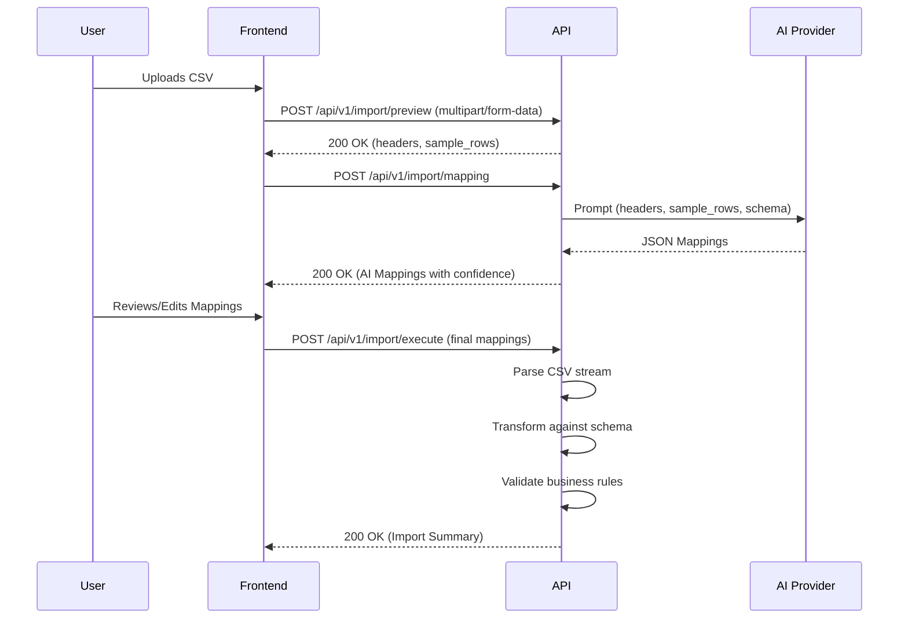

# 🚀 GrowEasy AI CSV Importer


> A modern, AI-powered CSV import wizard that effortlessly maps any uploaded spreadsheet to your CRM using LLM semantics, eliminating manual data entry headers mapping.

---

## ✨ Features

- **🤖 AI-Powered Mapping:** Automatically maps chaotic CSV columns to standardized CRM fields using semantic analysis (Anthropic Claude).
- **⚡ High-Performance Streaming:** Parses massive CSV files using Node.js Streams without memory bloat.
- **🛡️ Rock-Solid Validation:** Robust business rule enforcement (Joi) with detailed field-level error reporting.
- **🎨 Modern UI/UX:** A stunning, fully responsive React wizard built with accessibility (A11y) and keyboard navigation in mind.
- **🐳 Docker Ready:** Full multi-stage Docker & Docker Compose setup for production deployments.
- **📚 API Documentation:** Built-in Swagger UI for exploring the REST API.
- **🧪 Fully Tested:** Comprehensive test suite for both frontend and backend (Jest, Vitest, React Testing Library).

---

## 🏗️ Architecture



## 📂 Project Structure

```
d:\GrowEasy\
├── client/                 # React SPA (Vite)
│   ├── src/                # Frontend source code
│   └── tests/              # Vitest & React Testing Library tests
├── src/                    # Backend Node.js API
│   ├── controllers/        # Express route controllers
│   ├── services/           # Business logic & AI Integration
│   └── ...                 
├── tests/                  # Backend Jest tests
├── examples/               # Sample CSV datasets
├── docs/                   # Architecture diagrams
├── postman/                # API collections
├── docker-compose.yml      # Local dev orchestration
└── README.md               # This file
```

---

## 🚀 Quick Start (Docker)

The easiest way to run the application is using Docker.

1. **Clone the repository:**
   ```bash
   git clone https://github.com/the-piyushgoel/Smart-crm-importer.git
   cd Smart-crm-importer
   ```

2. **Configure Environment:**
   Create a `.env` file in the root directory:
   ```env
   NODE_ENV=development
   PORT=3000
   CORS_ORIGIN=http://localhost:5173
   AI_PROVIDER=claude
   ANTHROPIC_API_KEY=your_api_key_here
   ```

3. **Start the containers:**
   ```bash
   docker-compose up --build
   ```

4. **Access the application:**
   - Frontend: `http://localhost:80`
   - Backend API: `http://localhost:3000`
   - Swagger Docs: `http://localhost:3000/api-docs`

---

## 💻 Local Development

To run the application locally without Docker:

### Backend Setup
```bash
# Install dependencies
npm install

# Start development server
npm run dev

# Run tests
npm test
```

### Frontend Setup
```bash
cd client

# Install dependencies
npm install

# Start Vite dev server
npm run dev

# Run tests
npm test
```

---

## 📖 API Documentation

Once the backend is running, you can access the Swagger UI documentation at:
**[http://localhost:3000/api-docs](http://localhost:3000/api-docs)**

### Core Endpoints:
- `POST /api/v1/import/preview`: Upload a CSV and extract headers/sample rows.
- `POST /api/v1/import/mapping`: Generate AI-powered semantic mappings.
- `POST /api/v1/import/execute`: Execute the import pipeline and validate data.

---

## 📦 Sample Datasets

We've included several sample datasets in the `examples/` directory to help you test the application:
- `employees.csv`: Standard dataset for testing mappings.
- `malformed.csv`: Tests parsing robustness.
- `duplicate_headers.csv`: Tests frontend validation constraints.

---

## 🚀 Deployment

The repository includes production-ready deployment configurations:
- **Vercel (`client/vercel.json`)**: For the frontend SPA.
- **Railway (`railway.json`)**: For the backend Node.js API.
- **GitHub Actions (`.github/workflows/ci.yml`)**: For continuous integration testing.

---

## 🔮 Roadmap

- [ ] Support for Excel (`.xlsx`) files.
- [ ] Real-time WebSocket progress updates for massive imports.
- [ ] Save mapping templates for recurring uploads.

---

Built with ❤️ by the Engineering Team.
