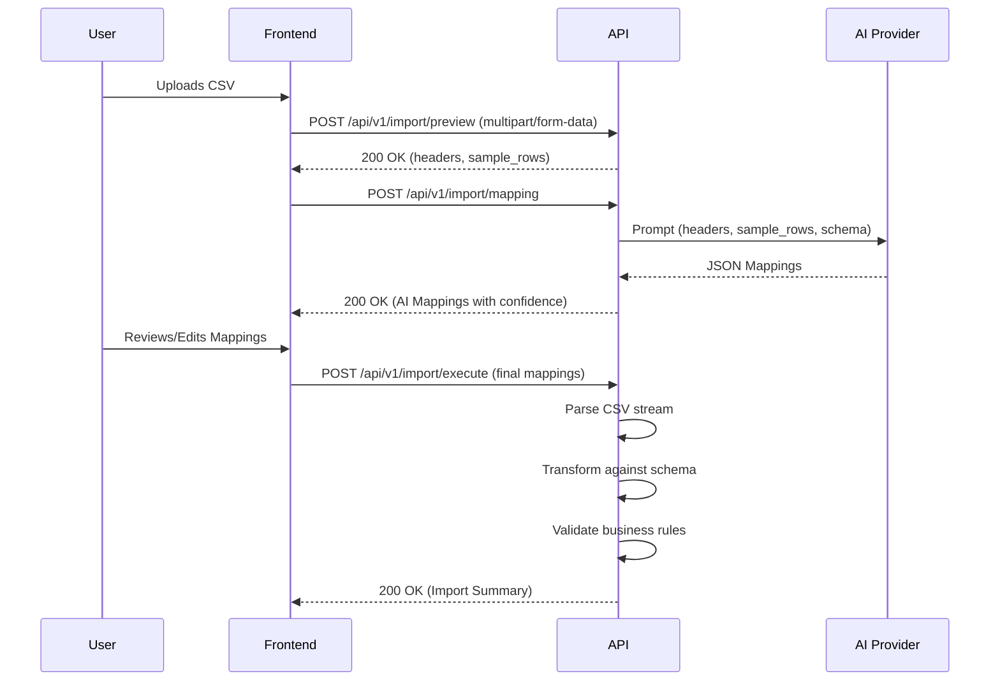

# GrowEasy CSV Importer Architecture

The GrowEasy CSV Importer is a robust, modular full-stack application designed to automatically parse, map, and import structured CSV data into a target CRM using AI.

## High-Level Architecture

The system follows a classic **client-server architecture**:

- **Frontend (Client)**: A React-based SPA that manages a stateful multi-step wizard. It handles file upload, rendering data previews, manual user corrections to mappings, and streaming import progress.
- **Backend (Server)**: A Node.js/Express REST API that handles parsing, orchestrates AI mapping requests to external LLM providers, transforms data against business rules, and simulates saving to a database.

## Components

### 1. Frontend Architecture

The frontend is built with React and Vite. It utilizes a centralized Zustand store (`useImportStore.js`) to manage the wizard's lifecycle.

**Core Steps**:
1. **UploadStep**: Validates file metadata and delegates file reading.
2. **PreviewStep**: Displays extracted headers and sample rows.
3. **MappingStep**: Triggers backend AI mapping and renders the AI's suggestions with confidence scores.
4. **ReviewStep**: Allows users to manually correct mappings, assign fallbacks, or ignore columns. Checks for duplicate mappings.
5. **ExecuteStep**: Submits the final approved schema to the backend for data import.
6. **SummaryStep**: Displays a structured report of successful, skipped, and failed rows.

### 2. Backend Architecture

The backend is built with Express and is structured into a modular service layer pattern.

**Core Services**:
1. **CSV Engine (`csvParser.js`)**: Uses `csv-parse` and Node.js Streams to process large CSVs efficiently without memory exhaustion. Includes heuristic delimiter detection.
2. **AI Engine (`mappingService.js` / `providerFactory.js`)**: Connects to Claude, Gemini, or OpenAI via an abstraction layer. Orchestrates prompt engineering for semantic header mapping.
3. **Business Validator (`businessValidator.js`)**: Ensures records meet GrowEasy's CRM rules (e.g., at least one contact method required).
4. **Execution Pipeline (`importService.js`)**: Merges CSV parsing, mapped headers, and business validation into a unified pipeline.

## System Flow

## Security & Reliability
- **Data Validation**: Joi schemas enforce strict validation at the API boundaries.
- **Rate Limiting**: Protects AI endpoints from abuse.
- **Graceful Failure**: The AI mapping engine uses a multi-attempt retry system with a fallback to simple string heuristics if the LLM is unreachable.
- **File Upload Protection**: Multer is configured to reject non-CSV files and files exceeding 5MB.
